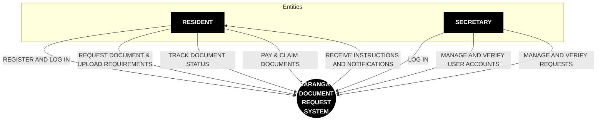

# Context Flow Diagram (CFD / DFD Level 0)
## Barangay Document Request System (BDRS)

This **Context Flow Diagram (CFD)** follows the official system diagram architecture. It illustrates the high-level data flows between the external entities (**RESIDENT** and **SECRETARY**) and the central process (**BARANGAY DOCUMENT REQUEST SYSTEM**).

---

## 1. Context Flow Diagram

---

## 2. Detailed Data Flow Breakdown (Based on System Implementation)

### A. RESIDENT DATA FLOWS

#### 1. REGISTER AND LOG IN
- **Description**: The resident accesses the system portal to register an account or authenticate existing credentials.
- **Data Transmitted**: Full Name, Birthdate, Gender, Civil Status, Contact Number, Email, Password, Address, Selected **Purok**, and uploaded **Valid ID Photo**.
- **System Components**: `registerresidentform.jsx`, `login.jsx`, Firebase Authentication.

#### 2. REQUEST DOCUMENT & UPLOAD REQUIREMENTS
- **Description**: The resident submits an application for a specific barangay document and uploads required supporting documents.
- **Data Transmitted**:
  - **Selected Document**:
    1. *Barangay Clearance* (`barangayclearanceform.jsx`)
    2. *Certificate of Residency* (`certificateofresidencyform.jsx`)
    3. *Certificate of Indigency* (`certificateofindigencyform.jsx`)
    4. *Business Permit* (`businessclearanceform.jsx`)
  - **Selected Purok**: `Purok Malipayon`, `Purok Bagong-Silang`, `Purok Acacia`, `Purok Orchids`, `Purok Boguenvilla`.
  - **Uploaded Requirements**: Valid ID, Purok Clearance, CTC / Sedula, or Business DTI / SEC Registration.

#### 3. RECEIVE INSTRUCTIONS AND NOTIFICATIONS
- **Description**: The system transmits status alerts, fee breakdowns, and pickup instructions back to the resident.
- **Data Transmitted**: In-app notifications (`ResidentNotificationBell`), request approval/rejection notices, pickup schedule dates, and document total fee details.

#### 4. TRACK DOCUMENT STATUS
- **Description**: The resident checks the real-time processing stage of submitted requests.
- **Data Transmitted**: Request ID, status filter queries (*Pending*, *Processing*, *Approved*, *Completed*, *Rejected*).
- **System Components**: `my request.jsx`, `approved_requests.jsx`, `completed_requests.jsx`, `rejected_requests.jsx`.

#### 5. PAY & CLAIM DOCUMENTS
- **Description**: The resident settles document fees and receives the requested document.
- **Data Transmitted**: Payment confirmation, copy count calculation (First Copy Fee + Additional Copy Fee), and physical document issuance.

---

### B. SECRETARY DATA FLOWS

#### 1. LOG IN
- **Description**: The Secretary (Admin) authenticates administrative credentials to access the management portal.
- **Data Transmitted**: Admin Username / Email and Password.
- **System Components**: `login.jsx`, `AdminSidebar.jsx`.

#### 2. MANAGE AND VERIFY USER ACCOUNTS
- **Description**: The Secretary evaluates newly registered resident profiles.
- **Data Transmitted**: Review of submitted Valid ID photos, user approval or rejection decisions (`user_pending.jsx`, `user_registered.jsx`).

#### 3. MANAGE AND VERIFY REQUESTS
- **Description**: The Secretary inspects incoming document applications, updates status, and issues document approvals or rejections.
- **Data Transmitted**:
  - Verification of attached requirement files (`document_request.jsx`).
  - Status updates (**Pending** -> **Processing** -> **Approved** -> **Completed**).
  - Rejection remarks and feedback notes.
  - Payment record tracking (`payment.jsx`), analytics & monthly reports (`reports.jsx`), trash management (`trash.jsx`), and system fee configuration (`settings.jsx`).

---

## 3. Data Flow Summary Matrix

| External Entity | Data Flow Line | Direction | Key Data Content | System Modules |
| :--- | :--- | :--- | :--- | :--- |
| **RESIDENT** | REGISTER AND LOG IN | Resident -> System | User Profile, Address, Purok, Valid ID, Login Credentials | `registerresidentform.jsx`, `login.jsx` |
| **RESIDENT** | REQUEST DOCUMENT & UPLOAD REQUIREMENTS | Resident -> System | Document Type, Purpose, Purok, Attached Requirements | `barangayclearanceform.jsx`, `certificateofresidencyform.jsx`, `certificateofindigencyform.jsx`, `businessclearanceform.jsx` |
| **RESIDENT** | RECEIVE INSTRUCTIONS AND NOTIFICATIONS | System -> Resident | Status Alerts, Pickup Schedule, Fee Breakdown | `ResidentNotificationBell.jsx`, `my request.jsx` |
| **RESIDENT** | TRACK DOCUMENT STATUS | Resident -> System | Real-time Status (*Pending*, *Approved*, *Completed*, *Rejected*) | `my request.jsx`, `approved_requests.jsx`, `completed_requests.jsx`, `rejected_requests.jsx` |
| **RESIDENT** | PAY & CLAIM DOCUMENTS | Resident -> System | Payment Record, Document Claim Acknowledgement | `RequestDetailsModal.jsx` |
| **SECRETARY** | LOG IN | Secretary -> System | Admin Credentials | `login.jsx`, `AdminSidebar.jsx` |
| **SECRETARY** | MANAGE AND VERIFY USER ACCOUNTS | Secretary -> System | Identity Verification, Account Approval / Rejection | `user_pending.jsx`, `user_registered.jsx` |
| **SECRETARY** | MANAGE AND VERIFY REQUESTS | Secretary -> System | Requirements Verification, Status Updates, Fee Management, Document Printing | `document_request.jsx`, `completed.jsx`, `payment.jsx`, `reports.jsx`, `settings.jsx` |
