# Barangay Document Request System (BDRS) Flowchart

This flowchart outlines the complete end-to-end process of the Barangay Document Request System, utilizing standard flowchart symbols:

- **Oval `([ ])`**: Start and End Points
- **Parallelogram `[/ /]`**: Input and Output Operations
- **Rectangle `[ ]`**: Standard Processes
- **Diamond `{ }`**: Decisions and Conditions
- **Double-lined Rectangle `[[ ]]`**: Predefined Processes / Subroutines
- **Cylinder `[( )]`**: Database Storage

## System Flow Diagram

```mermaid
flowchart TD
    %% Start
    Start([Start])
    
    %% Resident Side
    ResidentInput[/Input: Resident fills out Request Form & Uploads Valid ID/]
    ValidateInput{Are all required fields provided?}
    
    SubmitRequest[Process: Submit Document Request]
    SaveDB[(Database: Save Request as 'Pending' in Firestore)]
    
    %% System Expiration Check (7-day limit)
    ExpirationCheck{Decision: Has 7 days passed?}
    AutoExpire[Process: Update Status to 'Expired']
    NotifyExpire[(Database: Log Activity & Notify 'Expired')]
    
    %% Admin Side
    AdminLogin[[Predefined Process: Admin Authentication]]
    AdminDashboard[/Output: Admin Views Dashboard & Pending Requests/]
    ReviewRequest[Process: Admin Reviews Request Details and Valid ID]
    
    ApproveDecision{Decision: Admin Action}
    
    %% Approval Path
    Approve[Process: Update Status to 'Completed']
    NotifyApprove[(Database: Log Activity & Notify 'Approved')]
    GenerateDoc[[Predefined Process: Generate & Print Document]]
    IssueDoc[/Output: Resident Receives Document/]
    
    %% Trash Path
    Reject[Process: Update Status to 'Trash']
    NotifyTrash[(Database: Log Activity & Notify 'Trashed')]
    
    %% Trash/Expired Management
    TrashView[/Output: Admin Views Trash/Expired Requests/]
    TrashDecision{Decision: Restore or Delete?}
    
    Restore[Process: Update Status to 'Pending']
    NotifyRestore[(Database: Log Activity & Notify 'Restored')]
    
    PermanentDelete[Process: Permanently Delete from Firestore]
    NotifyDelete[(Database: Log Activity & Notify 'Deleted')]
    
    %% End
    End([End])

    %% Defining the Flow
    Start --> ResidentInput
    ResidentInput --> ValidateInput
    ValidateInput -- No (Fix Errors) --> ResidentInput
    ValidateInput -- Yes --> SubmitRequest
    SubmitRequest --> SaveDB
    
    SaveDB --> ExpirationCheck
    
    %% Expiration Flow
    ExpirationCheck -- Yes --> AutoExpire
    AutoExpire --> NotifyExpire
    NotifyExpire --> TrashView
    
    %% Normal Admin Flow
    SaveDB --> AdminLogin
    AdminLogin --> AdminDashboard
    ExpirationCheck -- No --> AdminDashboard
    
    AdminDashboard --> ReviewRequest
    ReviewRequest --> ApproveDecision
    
    %% Approve Action
    ApproveDecision -- Approve --> Approve
    Approve --> NotifyApprove
    NotifyApprove --> GenerateDoc
    GenerateDoc --> IssueDoc
    IssueDoc --> End
    
    %% Trash Action
    ApproveDecision -- Move to Trash --> Reject
    Reject --> NotifyTrash
    NotifyTrash --> TrashView
    
    %% Trash Management
    TrashView --> TrashDecision
    TrashDecision -- Restore --> Restore
    Restore --> NotifyRestore
    NotifyRestore --> AdminDashboard
    
    TrashDecision -- Permanently Delete --> PermanentDelete
    PermanentDelete --> NotifyDelete
    NotifyDelete --> End
```

